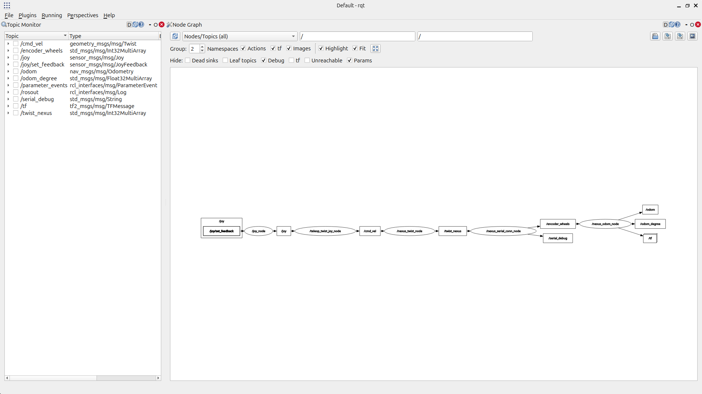

# NEXUS 4WD Mecanum Robot - ROS 2 Package

This is a ROS 2 Jazzy package developed to control and simulate the Nexus 4WD Mecanum robot platform.
 The project includes arduino program and nodes for teleoperation (manually or PS4 Controller), odometry, serial communication with an Arduino 328 controller and robot description for visualization and simulation.

## Project Overview

The Nexus 4WD Mecanum robot is equipped with 4 mecanum wheels, enabling omnidirectional movement. This ROS 2 package provides essential functionalities for:

- **Serial communication** with the onboard Arduino 328 controller.
- **Teleoperation nodes** for remote and manual control.
- **Odometry node** to estimate the robot's position.
- **Robot description** for visualization in RViz and simulation.
- **Bringup launch file** to start the system.

---

## Package Structure
src/
├── nexus_bringup       # Launch file and system bringup
├── nexus_control       # Teleoperation and control logic
├── nexus_description   # URDF and meshes for the robot
├── nexus_odom          # Odometry node
├── nexus_serial_conn   # Serial communication node


---

## System Architecture

The system consists of multiple ROS 2 nodes communicating via topics, as illustrated in the following graph:



---

## Nodes

| Node                  | Description                                                                                                    |
|-----------------------|----------------------------------------------------------------------------------------------------------------|
| `/joy_node`           | (External) Reads the inputs from PS4 Controller and map them                                                   |

| `/teleop_node`        | (External) Sends command velocities from PS4 Controller to nexus_twist_node                                    |
| `/nexus_move_node`    |            Sends command velocities manually (optional) to nexus_twist_node                                    |

| `/nexus_twist_node`   |            Converts `/cmd_vel` to scaled and ready to be sent `/twist_nexus` commands (No prioritizing yet)    |

| `/nexus_serial_conn`  |            Handles serial data to and from Arduino (only recieve & publish data)                               |

| `/nexus_odom`         |            Recieves wheel velocities (from 4 encoders ), computes and publish odom data                        |

| `/nexus_bringup`      |            Launch file for starting the system                                                                 |

---

## Topics

| Topic                  | Message Type                           | Description                                           |
|------------------------|----------------------------------------|-------------------------------------------------------|
| `/joy`                 | `sensor_msgs/Joy`                      | Joystick inputs                                       |
| `/joy/set_feedback`    | `sensor_msgs/JoyFeedbackArray`         | Feedback to joystick                                  |
| `/cmd_vel`             | `geometry_msgs/Twist`                  | Standard robot velocity commands                      |
| `/twist_nexus`         | `std_msgs/Int32MultiArray`             | Nexus-specific velocity commands                      |
| `/encoder_wheels`      | `std_msgs/Int32MultiArray`             | Wheels encoder raw data                               |
| `/serial_debug`        | `std_msgs/String`                      | Debug messages from serial connection (internal use)  |
| `/odom`                | `nav_msgs/Odometry`                    | Robot odometry                                        |
| `/odom_degree`         | `std_msgs/Float32MultiArray`           | Robot only x, y and yaw/heading in degrees            |
| `/tf`                  | `tf2_msgs/TFMessage`                   | TF transforms                                         |

---


## How to Use

1. **Create the workspace:**
   ```bash
   cd
   mkdir Nexus_4WD_Mecanum_Robot
   cd Nexus_4WD_Mecanum_Robot
   git clone https://github.com/OsamahShamsan/Nexus_4WD_Mecanum_Robot.git


2. **Build the workspace:**
   ```bash
   colcon build

3. **Source the workspace:**
    ```bash
    source /opt/ros/jazzy/setup.bash
    source ~/nexus_4wd_mecanum_ws/install/setup.bash

4. **To move robot through PS4 Controller:**
    Turn on the ps4 controller (if another Joystick e.g. ps3 or xbox => see github-ros2-teleop_twist_joy)

   **To move robot manually:**
    ```bash
    ros2 run nexus_control nexus_move_node --ros-args   -p vx:=1.0 -p vy:=0.0 -p w:=0.0 -p t:=2.0 -p M:=l

5. **Launch the robot system:**
    ```bash
    ros2 launch nexus_bringup bringup.launch.py


